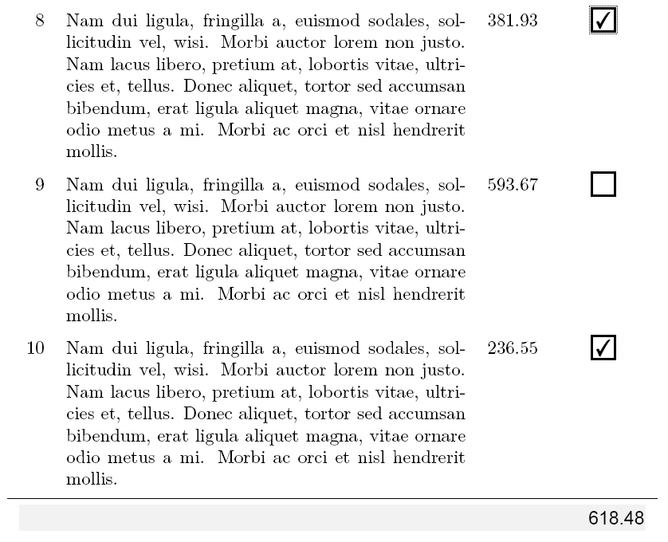

# Self-calculating PDF

This example shows how an order list can be created using pdf controls. The selected items are totalled at the end of the table.

Not every PDF viewer supports JavaScript!

The prerequisite is the installation of [TeX Live](https://tug.org/texlive/).
